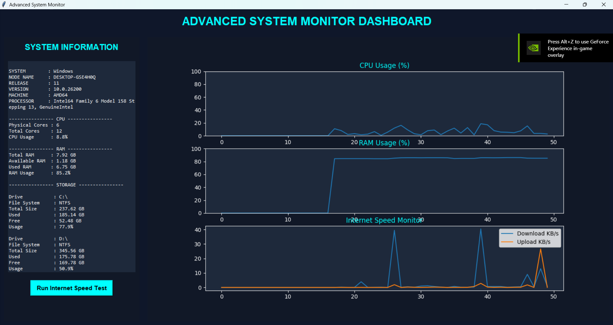

# Advanced System Monitor Dashboard

A modern real-time system monitoring dashboard built using Python, Tkinter, Matplotlib, and Psutil.

This application provides live visualization of:

- CPU Usage
- RAM Usage
- Internet Upload/Download Speed
- Storage Information
- Battery Status
- Network Information
- System Specifications

---

# Features

## Real-Time Monitoring
- Live CPU usage graph
- Live RAM usage graph
- Real-time internet upload/download monitoring

## System Information
- OS details
- Processor information
- RAM statistics
- Storage statistics
- Battery information
- Network information

## Internet Speed Test
- Download speed
- Upload speed
- Ping monitoring

## Modern GUI
- Dark themed interface
- Responsive dashboard
- Graph visualization using Matplotlib

---

# Tech Stack

- Python
- Tkinter
- Matplotlib
- Psutil
- Speedtest-cli

---

# Project Structure

```bash
project-folder/
│
├── read_os.py
├── requirements.txt
└── README.md

---

# Installation

## 1. Clone the Repository

```bash
git clone https://github.com/your-username/system-monitor-dashboard.git
```

## 2. Navigate to the Project Folder

```bash
cd system-monitor-dashboard
```

## 3. Install Dependencies

```bash
pip install -r requirements.txt
```

---

# Requirements

```txt
psutil
matplotlib
speedtest-cli
```

---

# How to Run the Project

## Step 1 — Open Terminal or CMD

Navigate to your project folder:

```bash
cd "F:\USYD Projects\Sem1\Intro-to-Programming\CPM"
```

---

## Step 2 — Install Required Libraries

```bash
pip install -r requirements.txt
```

---

## Step 3 — Run the Python File

```bash
python read_os.py
```

If `python` does not work, try:

```bash
python3 read_os.py
```

---

# Dashboard Preview

The dashboard contains:

## Left Panel
- System information
- Internet speed test button
- Battery status
- Storage details

## Right Panel
- CPU Usage Graph
- RAM Usage Graph
- Internet Speed Graph

---

# Screenshots

Add screenshots here after running the application.

Example:

```md

```

---

# Future Improvements

- GPU monitoring
- Temperature monitoring
- Process manager
- Disk health monitoring
- Export reports
- Cross-platform optimization

---

# Author

Tejas Ramteke
University of Sydney
